## Introduction

Power Pages is a helpful tool that makes it easy to create websites using low-code development. It also allows for rich integration with other Power Platform solutions.

Recently, I had a requirement to use editable grids within Power Pages for list data. I managed to find some documentation on using code components for Power Pages here: [https://learn.microsoft.com/en-us/power-pages/configure/tutorial-pcf-code](https://learn.microsoft.com/en-us/power-pages/configure/tutorial-pcf-code)

Reading this, I found it confusing to understand as I felt it lacked clarity on whether you could in fact use editable grids.

To help streamline the process and save you time, I have put together a quick guide on how to use an editable grid in your Power Pages lists.

### Add the Editable Grid component to your desired table

I am using the Accounts table with a solution called "Test solution" for this demonstration.

1. Within your solution, navigate to Tables and then the ellipses and click "Switch to Classic".
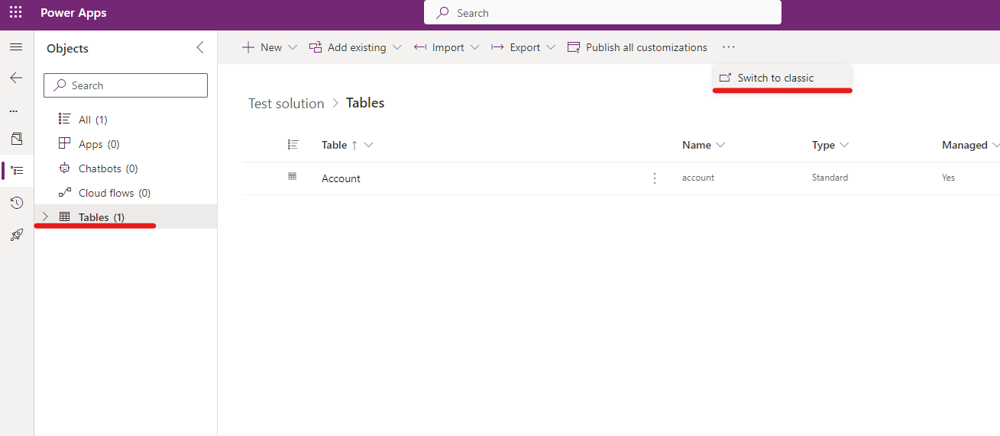
2. Double click the Account Table (also called Entity).
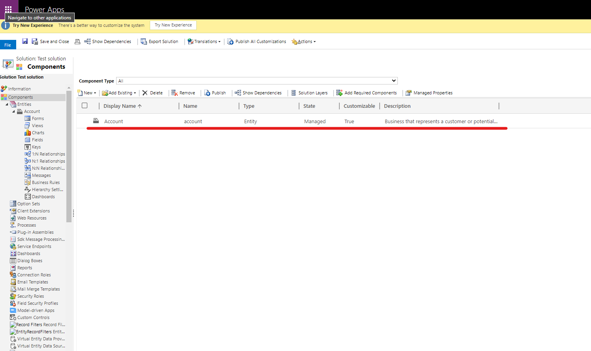
3. Click the Controls tab and then Add Control...
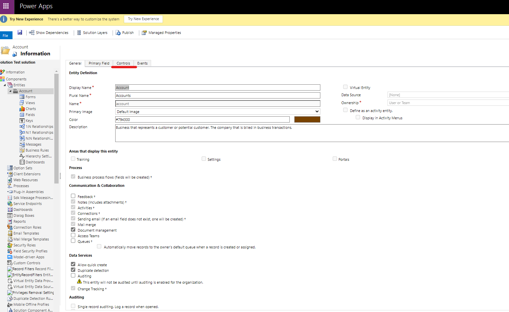
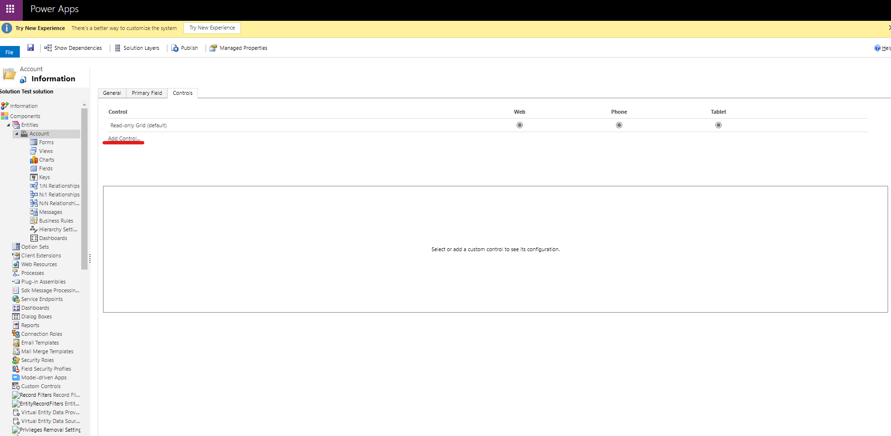
4. In the Add control menu, search for and select the PowerApps grid control, then click Add.
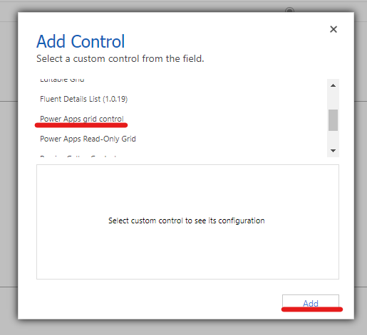
5. Ensure that the Power Apps grid control is enabled for Web and Phone/Tablet if required.
6. Select the control to bring up the properties.
7. Set the value of Enable editing to "Yes". You can enable other properties too if required, and I recommend you check out the documentation to find out which each property does.
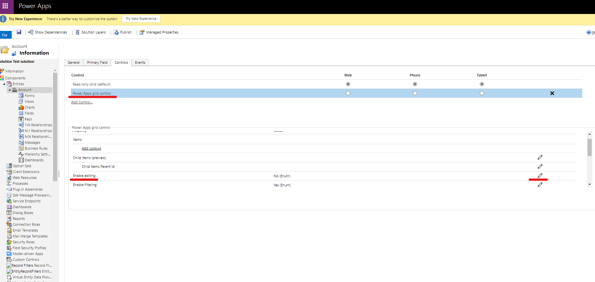
8. Click Save, and then click Publish
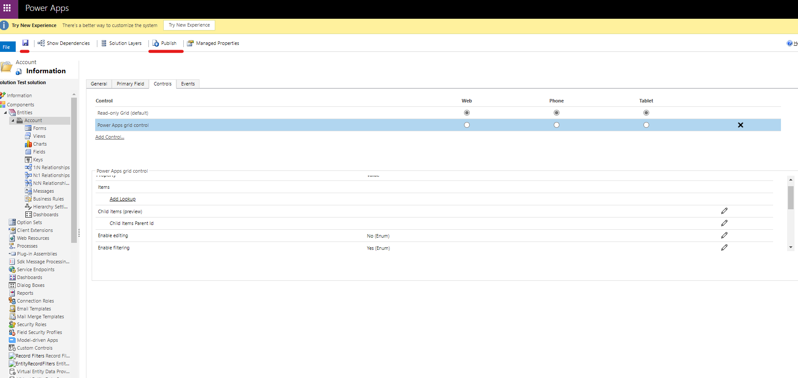

### Add the component to Portal Management

Now we have our editable grid added to our table, we need to configure Power Pages to use it. The first step is to add a new List so it can then be selected when adding it to our page.

1. Navigate to make.powerpages.microsoft.com
2. Select the elipses against your site and select Portal management
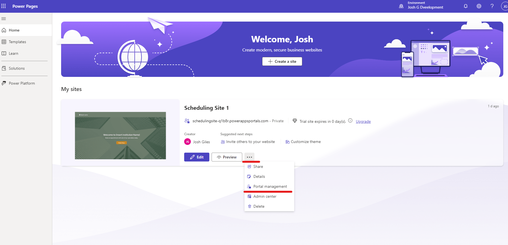
3. Under Content, go to Lists, click New
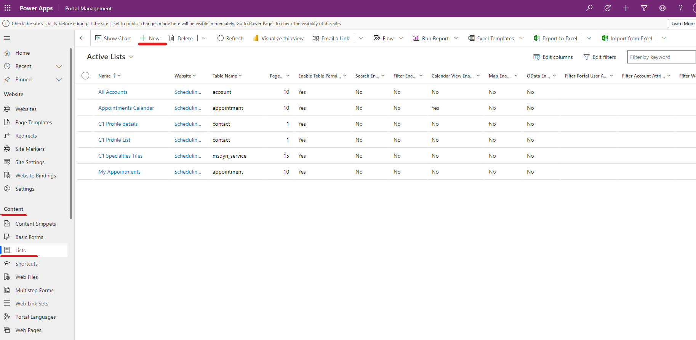
4. Give your List a Name, select the Table, and the website
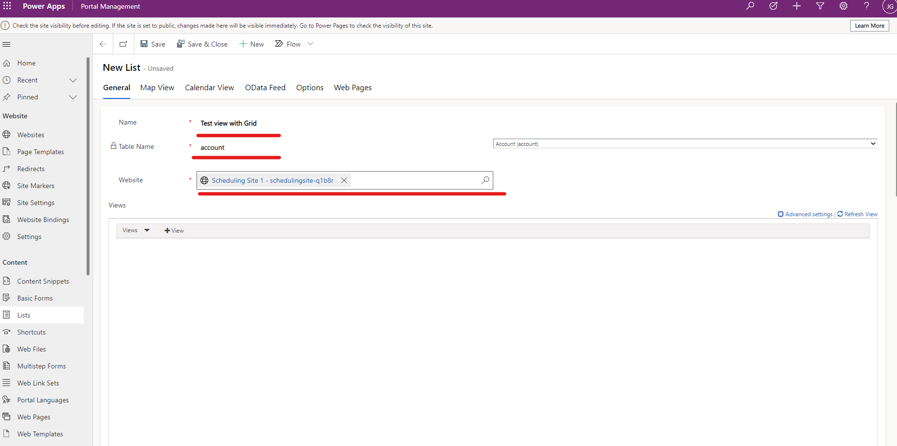
5. Add your views
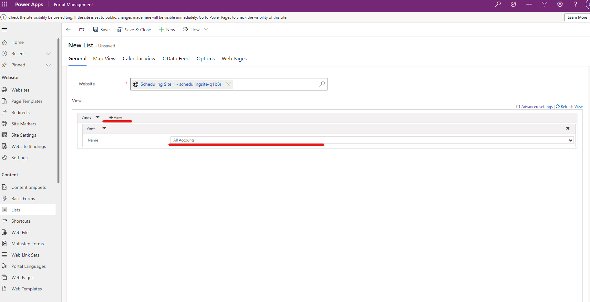
6. Make sure that Use a configured code component is set to yes. You can change other properties here as needed, and then click Save and Close
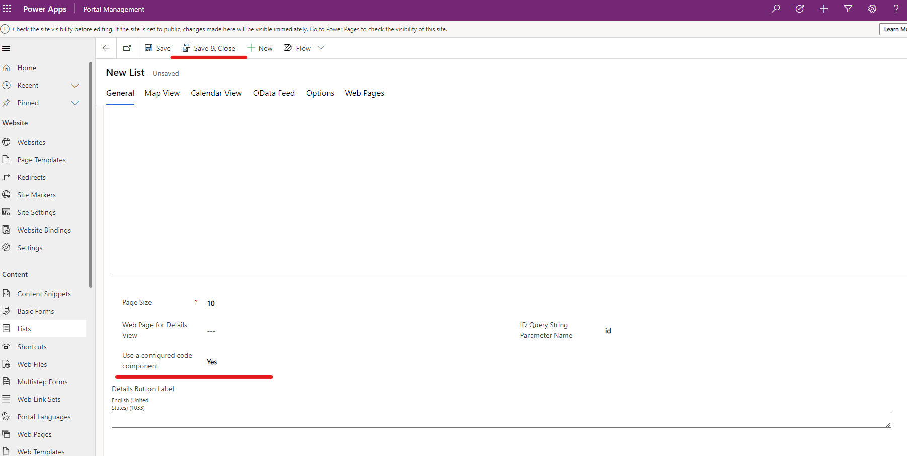

### Add the editable grid to your page

The final step is to add the list to our page and test it out.

1. navigate back to your Power Page site and edit it

2. go to the page where you wish to add the editable grid. In my example I have a test page called Temp
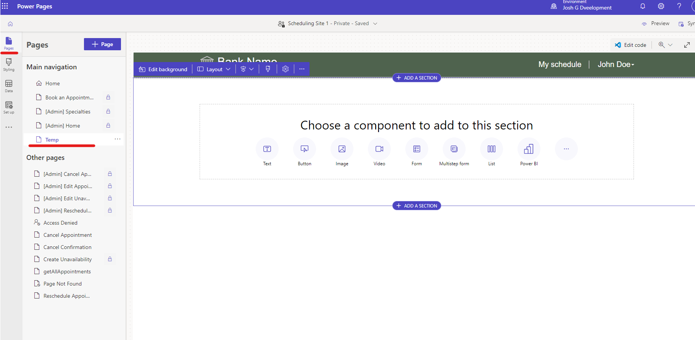
3. Add a List to the page under the Choose a component to add to this section
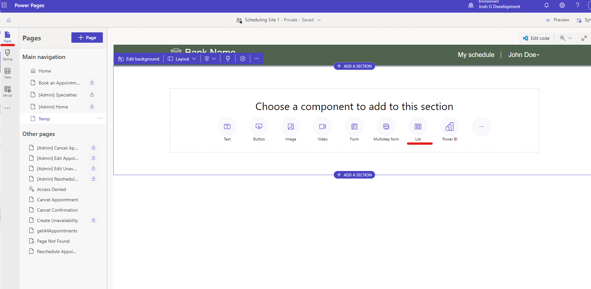
4. Select the existing list we added in the previous steps, in my case it's the Test view with Grid
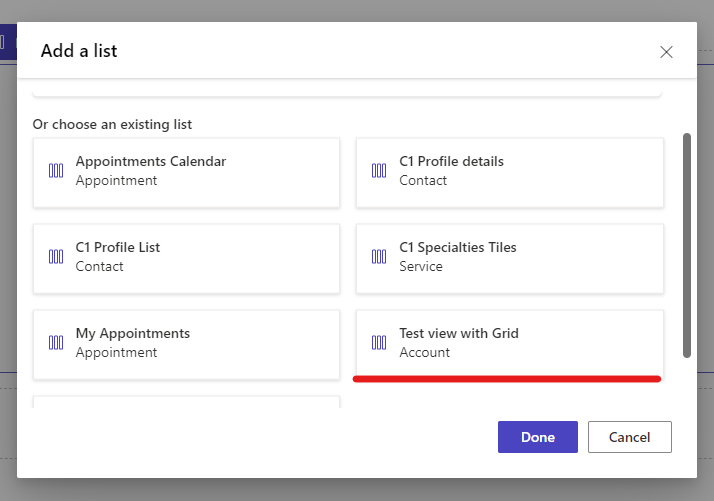
5. Sync and preview your page, you should now see the editable grid displayed in the preview page.
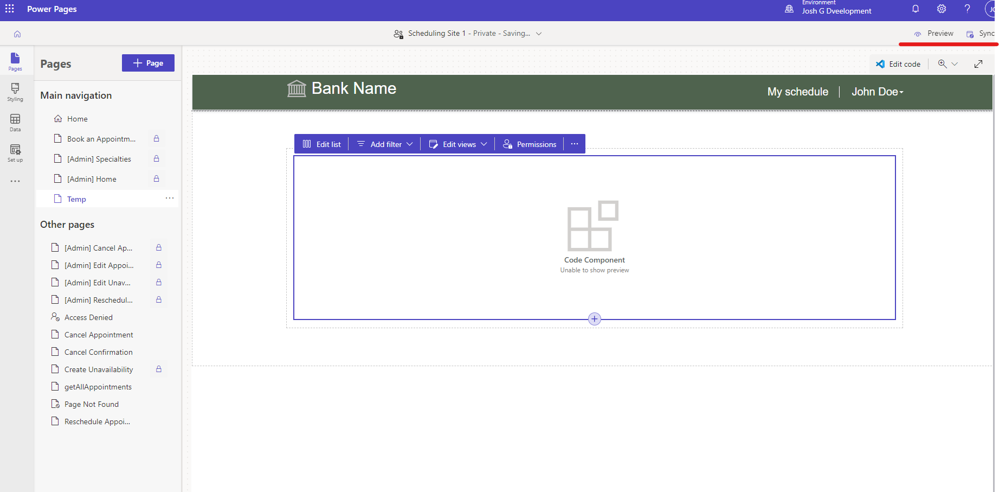

## Conclusion

We should now be able to see our editable grid component in action:



In this quick tutorial I have demonstrated how you can quickly set up a List in Power Pages to use the editable grid component.

I hope this has been helpful and saves you some time if you ever need to add an editable grid to your Power Pages site. If you have any feedback, feel free to leave a comment below.
