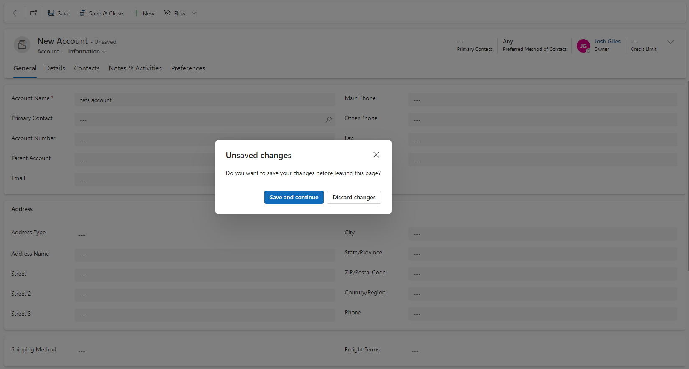

With [Fluent UI v9](https://react.fluentui.dev/?path=/docs/concepts-introduction--page) slowly rolling out across Power Platform and beyond, I recently noticed that model-driven Apps now make use of the Fluentui v9 dialog, for example when trying to discard a new record: 

When using [Custom Pages](https://learn.microsoft.com/en-us/power-apps/maker/model-driven-apps/model-app-page-overview) in Model-Driven Apps, keeping a consistent design across the app is important, as it will ensure a good user experience and interface for your users. The dialog is an importnat piece to this puzzle, and will provide context to users when required (like in my example above when trying to discard a new record).

## Introducing: The Fluentui v9 Canvas component

