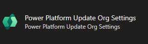
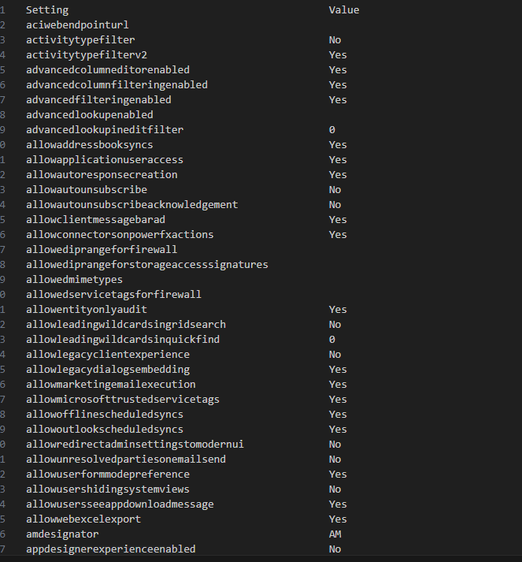
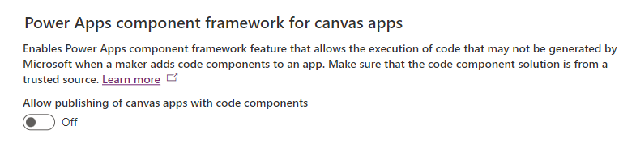
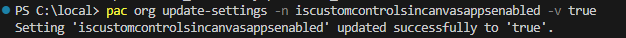
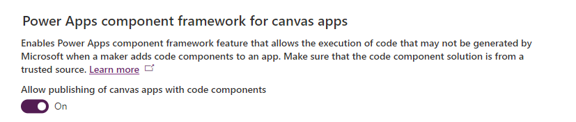
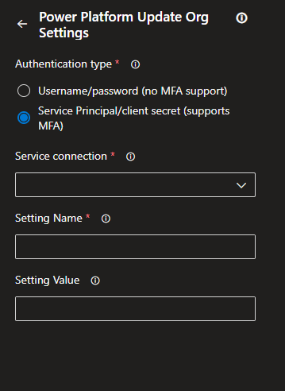
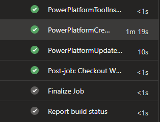
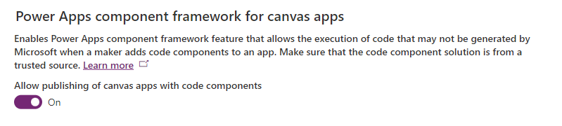

Recently whilst looking through the [Power Platform build tools](https://learn.microsoft.com/en-us/power-platform/alm/devops-build-tools), I stumbled upon a task which I didn't recognise called "**Update Org settings**": .

This appears to be an undocumented task, but on closer inspection, it looks to be a wrapper around the update-settings command found in the [PAC CLI tools](https://learn.microsoft.com/en-us/power-platform/developer/cli/reference/org#pac-org-update-settings). Unfortunately this also seems quite "light" on information, so I decided to investigate further.

Selecting my development environment and running pac org list-settings, I get a list of environment settings, neat! 

I can now pick out any of these settings and use them in the update-settings command. Something to note is that the parameter expects **true** or **false** values rather than Yes or No which the list-settings results suggest.

In my test, I wanted to enable code components for Canvas Apps in my environment, we can see the setting under Environment features: 

The setting I found in the list-settngs parameter which matched most closely was: **iscustomcontrolsincanvasappsenabled**

Lets give this a go and see if it works:

This looks promising, lets check the setting in Environment Admin... 

Nice!

So now that we have this working with the PAC CLI commands, lets see how this works within Power Platform Build tools tasks for Azure Devops pipelines. Using the same example as we used with PAC CLI to enable code components in Canvas Apps, we can add the **Update Org Settings** build tools task in our pipeline to achieve the same results.

When selecting the update org settings build tools task, it will ask for 3 settings: **Service Connection**, **Setting Name**, and **Setting value**.

For Service connection, use whichever method you have configured to authenticate to your Power Platform Environment. If not using them already, I would reccomend using a service principle for your pipelines, however. I have a blog post for setitngs these up which you can read [here](https://joshlgiles.com/p/understanding-service-connections-for-environments-in-power-platform-build-tools/).

The Setting name will be the same settings which we discovered in the PAC CLI List-Settings task, so in our example, we will set it to **iscustomcontrolsincanvasappsenabled** and the Setting value will need to be set to either true or false. In my example I set it to true. Click add to add the YAML code to the pipeline, and you should see something similar to this:

~~~YAML
- task: PowerPlatformUpdateOrgSettings@2
  inputs:
    authenticationType: 'PowerPlatformSPN'
    PowerPlatformSPN: 'MyServiceConnection'
    Name: 'iscustomcontrolsincanvasappsenabled'
    Value: 'true'
~~~

Now, if we add this task to part of an environment creation process, we can start to automate our preconfiguration of Environments to further enhance our Environment lifecycle processes. Using the above YAML in our pipeline, we can add this to a Create Environment task to make this possible:

~~~YAML
trigger:
- main

pool:
  vmImage: ubuntu-latest

steps:
- task: PowerPlatformToolInstaller@2
  inputs:
    DefaultVersion: true

- task: PowerPlatformCreateEnvironment@2
  inputs:
    authenticationType: 'PowerPlatformSPN'
    PowerPlatformSPN: 'MyServiceConnection'
    DisplayName: 'TestEnvironment'
    EnvironmentSku: 'Sandbox'
    LocationName: 'unitedkingdom'
    LanguageName: 'English'
    CurrencyName: 'GBP'
    DomainName: 'TestEnvironment'

- task: PowerPlatformUpdateOrgSettings@2
  inputs:
    authenticationType: 'PowerPlatformSPN'
    PowerPlatformSPN: 'MyServiceConnection'
    Name: 'iscustomcontrolsincanvasappsenabled'
    Value: 'true'
~~~

When we run this pipeline, a new Environment called TestEnvironment will be created, and it will have the Custom code components for Canvas Apps enabled. Runinng the pipeline, we can see it has run sucessfully:

Now when we check the created environment, the setting should be enabled:

Hopefully this has been helpful, and this should come in handy when spinning up new developer environments and allowing for these environments to be more disposable as part of a healthy ALM process and environment strategy.
